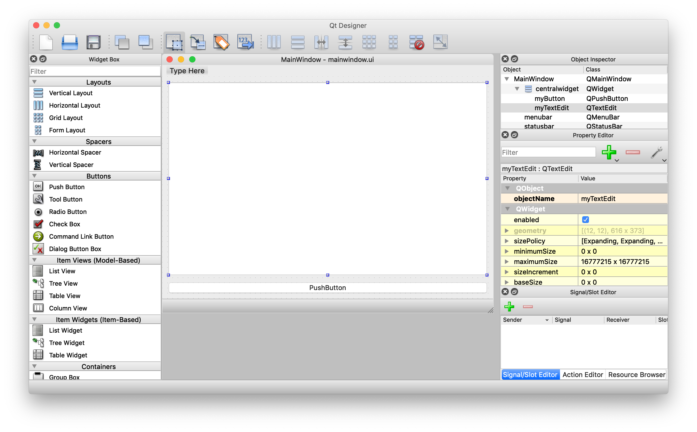
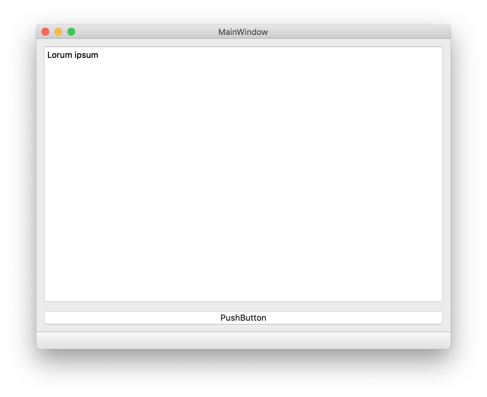

# Minimal Qt App in C++ and Python

This project shows the similarity between a Qt app, written in C++ and Python. Both implementations
use the same `mainwindow.ui` file, created in QtDesigner. 

## QtDesigner

Design your app in QtDesigner. In the `Property Editor -> Object -> objectName`, give every object a useful name. This is the variable name that refers to the widget in the code. Save the file in `*.ui` format.



## C++

The C++ project uses cmake and needs to know the location of the Qt library on your computer. For example, set the 
following shell environment variables pointing to the right location:

```bash
# Qt
export QT_LIBRARY_PATH=${HOME}/Development/lib/Qt5.12.0/5.12.0/clang_64
export PATH=${QT_LIBRARY_PATH}/bin:${PATH}
```

In the file `{project_dir}/cpp/CMakeList.txt` it gets referenced as
```cmake
find_package(Qt5Widgets PATHS $ENV{QT_LIBRARY_PATH})
```
Please look in [cpp/README.md](cpp/README.md) for more specifics about the C++ build and building macOS bundles with
code signing.

## Python

Install pyside2 in your virtual environment. 

To convert mainwindow.ui file into a python source file, run from the `{project_dir}/py` folder:
```bash
pyside2-uic ./ui/mainwindow.ui > ./src/ui_mainwindow.py 
```

Run the project with:
```bash
cd src
python main.py
```

## Screenshot

The final result will look like below:


