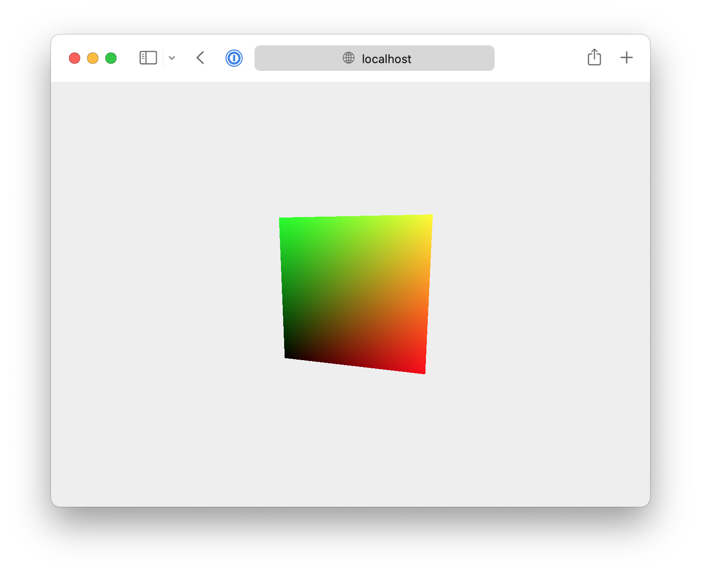

# Three.js template
_Gilbert François Duivesteijn_

Special thanks to the original author _Yuri Artiukh_.

## About

This template is a minimum starting point for a Three.js web project.




## Usage

At first time, install the dependencies with:

```sh
npm install
```

Then for development, run:

```sh
npm run dev
```

and to build for deployment, run:

```sh
npm run prod
```

To clean the installed packages and cache, run:

```sh
npm run clean
```

